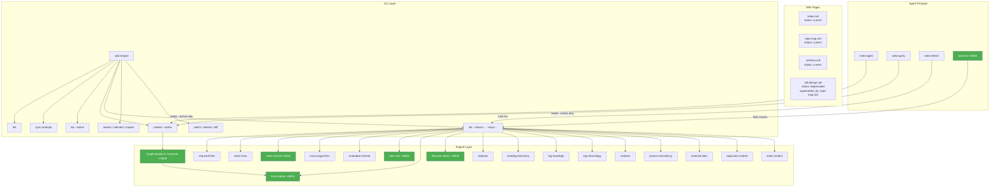
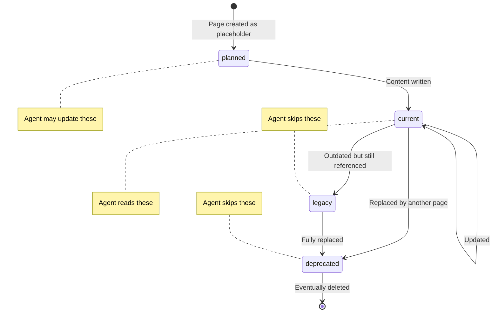

# go-wiki-engine — Deep Analysis & Improvement Plan

> [!NOTE]
> **This roadmap is fully implemented and deprecated.** All phases 1–5 shipped (see [log.md](../prologue/log.md)). The durable design decisions from Part 7 were archived in [lessons.md](lessons.md); the current architecture lives in [repo-map.md](../prologue/repo-map.md). Numbers inside this page (e.g. 13 checkers, v0.2.0) describe the state at the time of writing and are historical — the current linter has 17 checkers.

## Executive Summary

go-wiki-engine is a well-structured, zero-dependency Go CLI that provides the **plumbing layer** for managing repository-local wikis while delegating the **intelligence layer** to AI agent slash commands. The core architecture is sound: clean separation between `config`, `engine`, `scaffold`, and `upgrade` packages, a composable lint checker system (13 checkers), and a thoughtful multi-tool distribution model (GitHub Copilot, Claude Code, pi.dev).

The project is at a transitional point — **v0.2.0** with most of the original backlog completed (~80% of TODO items done). The next evolution should focus on **hardening the linter as the single source of structural truth** and adding the **page lifecycle** system you described.

---

## Part 1: Current State Assessment

### 1.1 Architecture — What's Working Well

| Aspect | Assessment |
|--------|-----------|
| Package layout | ✅ Clean 4-package structure (`config`, `engine`, `scaffold`, `upgrade`) |
| No external deps | ✅ Pure stdlib — exactly right for a global CLI tool |
| `go:embed` for scaffold | ✅ Elegant — `make sync-scaffold` copies `scaffold/` → `internal/scaffold/files/` |
| Composable lint checkers | ✅ `Checker` interface with 13 implementations, severity levels, stable sort |
| Multi-tool distribution | ✅ Single source `.wiki-instructions/` → symlinks to `.github/prompts/`, `.claude/commands/`, `.pi/skills/` |
| JSON output | ✅ Consistent `--json` envelope on all commands |
| Test coverage | ✅ Unit tests for all packages + integration test script |

### 1.2 Inconsistencies & Issues Found

#### Code Issues

| File | Issue | Severity |
|------|-------|----------|
| [engine.go](../../internal/engine/engine.go#L247-L253) | `jsonOK()` and `jsonErr()` helper functions are **dead code** — never called anywhere | Low |
| [engine_lint.go](../../internal/engine/engine_lint.go#L920-L924) | `Lint()` treats **all severities** as failures — a `SevInfo` issue causes `lint` to exit 1. This means stale-content info notes block CI. | **High** |
| [engine.go](../../internal/engine/engine.go#L80-L96) | Multiple `os.Open()` calls without `defer f.Close()` — using manual `f.Close()` after scanner loop works but is fragile | Medium |
| [main.go](../../cmd/wiki-engine/main.go#L95) | `runSyncPrompts()` silently swallows `os.Getwd()` error: `dir, _ := os.Getwd()` | Low |
| [config.go](../../internal/config/config.go#L131) | Duplicate `parsePositiveInt()` function — exists in both `config.go` and `main.go` | Low |
| `engine_cache.go` (deleted 2026-08) | `cachedList()` is defined but **never called** — dead code | Low |
| [engine_lint.go](../../internal/engine/engine_lint.go#L201-L205) | `isInsideInlineCode()` logic is flawed — counting backticks before/after is unreliable for nested or escaped backticks | Low |

#### Scaffold / Documentation Discrepancies

| Issue | Detail |
|-------|--------|
| **Missing `summarize.md` in live `.wiki-instructions/`** | Scaffold has 8 instruction files, live repo has only 7 — `summarize.md` is missing from `.wiki-instructions/`. This means `make sync-scaffold` was not run, or the live repo drifted. |
| **`todo.md` says impact (#19) is "⬜ Not started"** | But `impact` is fully implemented in [engine.go](../../internal/engine/engine.go#L604-L661) and tested. The `todo.md` is stale. |
| **Wiki operations/ has 8 files but only 3 are in required list** | `operations/` contains `ingest.md`, `lint.md`, `query.md`, `migrate-shims.md`, `onboard.md`, `refresh.md`, `summarize.md`, `watch.md`, `wiki-maintainer.md`. But `requiredFiles` in lint only checks `ingest.md`, `query.md`, `lint.md`. |
| **Prompt `argument-hint` values are inconsistent** | Some prompts have `argument-hint: "none"`, others have useful hints. `summarize.md` and `watch.md` have `"none"` but both could accept arguments. |
| **`.wikirc.example` uses `main...HEAD`, live `.wikirc` uses `master...HEAD`** | Inconsistent default branch naming |

#### Wiki Content Issues

| Issue | Detail |
|-------|--------|
| **No front matter on any wiki page** | Pages like `index.md`, `schema.md`, `repo-map.md` have **zero front matter** — no `status`, no `description`, no metadata at all |
| **No page lifecycle concept** | No way to mark pages as planned/current/deprecated/superseded |
| **`todo.md` is not in index.md catalog** | Wait — it IS in index.md. But `config.md` was added late and some links lack the `\| description` format |
| **`phases.md` only tracks 3 phases, all completed** | No forward-looking phases for v0.3+ features |

---

## Part 2: Your Vision — Mapped to Concrete Features

You described 5 key goals. Here's how they map to implementation:

### Goal 1: "Slash commands are coherent and useful"

**Current state:** 8 instruction files, well-structured, but with overlapping concerns:
- `ingest.md`, `refresh.md`, and `watch.md` all include similar "update wiki pages" steps
- `onboard.md` is very long (104 lines) and includes migration logic that overlaps with `migrate-shims.md`
- `summarize.md` is a context-loading strategy rather than a workflow — it supplements other prompts but the relationship isn't clear

**Plan:**
- Reduce redundancy: extract shared "update wiki" steps into a common section referenced by prompts
- Add lifecycle awareness to all prompts: teach agents to check `status:` front matter and skip `deprecated`/`legacy` pages
- Ensure each prompt has a single clear purpose with no overlap
- Add a `/wiki-lint` prompt that mirrors the CLI `lint` command and explains how to fix each issue type

### Goal 2: "Go tool is a hardening linter for markdown structure, links, front matter"

**Current state:** 13 checkers already cover a lot:
- ✅ Required files, index links, cross-page links, external links, orphans
- ✅ Heading hierarchy, markdown format (wiki-links, spaced links, empty links, unclosed links)
- ✅ Log headings, log chronology, markers, phase consistency, duplicate content, stale content

**Missing checkers:**
- ❌ **Front matter validation** — no checker for YAML front matter existence, required fields, or valid values
- ❌ **Index format validation** — no checker that all index.md entries use `[text]\(file) | description` format
- ❌ **Link-only enforcement** — no checker that ensures .md files use only markdown links (no bare URLs, no HTML `<a>` tags)
- ❌ **Lifecycle status validation** — no checker for valid `status:` values in front matter
- ❌ **Severity-gated exit code** — `Lint()` currently fails on ANY issue including `SevInfo`

### Goal 3: "Page lifecycle — status: planned | current | legacy | deprecated | superseded_by"

**Current state:** Zero lifecycle support. No front matter anywhere.

**Plan:**
- Define YAML front matter schema with `status:` field
- Valid statuses: `planned`, `current`, `legacy`, `deprecated`, `superseded_by: <page>`
- Lint checker to validate front matter
- `wiki-engine list` and `wiki-engine context` gain `--active` flag to filter by status
- Agents only load pages with `status: current` or `status: planned`
- `wiki-engine context` catalog output shows status per page

### Goal 4: "Index should be linted, all .md pages should have only markdown links"

**Current state:** Partially implemented:
- `indexLinksChecker` validates targets exist but doesn't check format consistency
- `markdownFormatChecker` catches wiki-style `[[links]]` but NOT bare URLs or HTML `<a>` tags

**Plan:**
- New `indexFormatChecker`: ensure every index entry follows `- [text]\(file.md) | description` pattern
- Expand `markdownFormatChecker` to also catch:
  - Bare URLs outside code blocks (`https://...` not wrapped in `[text]\(url)`)
  - HTML anchor tags `<a href="...">`
  - Reference-style links `[text][ref]` (if you want to disallow them)

### Goal 5: "CI/test should lint our own wiki"

**Current state:** `make lint` already runs both `go vet` AND `wiki-engine lint`. But:
- There's no GitHub Actions CI that uses it
- Wait — the log mentions `.github/workflows/test.yml` was added. Let me check...

Actually the `.github/workflows/` directory likely exists from the TODO items. The Makefile `lint` target already chains `vet` → `wiki-lint`. The improvement is to make the linter exit code respect severity levels so CI passes on `info` but fails on `error`/`warn`.

### Goal 6: "Active Wiki Graph Indexing (Context Optimization)"

**Current state:**
- The engine processes page listings and headers individually but has no unified model of page relationships (links).
- Linter contains localized parsing logic in `crossPageLinksChecker` (finds all page-to-page links) and `orphansChecker` (tracks index.md to page connectivity).

**Plan:**
- **Reusing Checker Logic for Graph Construction**: Extract the link-parsing regex and logic into a shared helper in the `engine` package. Construct a directed graph where pages are nodes and links are edges.
- **Filtering by Lifecycle Status**: During graph traversal (starting from `index.md`), retrieve the page lifecycle status from YAML front matter. Stop traversing and exclude any node (and its descendants, unless reachable via another active path) if its status is `deprecated` or `legacy`.
- **Sorting & Exporting**: Sort the active nodes topologically (by graph depth/hierarchy) or chronologically (by `created`/`updated` date, fallback to filesystem `mtime`).
- **Compact reference for agent**: Expose this graph index directly through `wiki-engine context --active`. Instead of dumping full page summaries, output a lightweight, structured map of active nodes, their relationships, and one-line descriptions. This serves as the agent's entry point to selectively fetch specific pages, avoiding context bloat.

---

## TODO Checklist

### Phase 1 — Front Matter & Lifecycle Foundation
- [x] 1A. Document front matter schema in `scaffold/wiki/schema.md` and add front matter to all `scaffold/wiki/*.md`
- [x] 1B. Add `ParseFrontMatter()` to `internal/engine/` (minimal hand-written YAML parser)
- [x] 1C. Add `frontMatterChecker` (required fields, valid status values, `superseded_by` linkage)
- [x] 1D. Add `--active` flag to `list` and `context` for lifecycle filtering

### Phase 1.5 — Graph Construction & Context Optimization
- [x] 1.5A. Extract shared link-parsing helper from `crossPageLinksChecker` and `orphansChecker`
- [x] 1.5B. Add `BuildWikiGraph()` — BFS from `index.md`, skips `deprecated`/`legacy` nodes
- [x] 1.5C. Implement topological (by depth) and chronological (by `created`/`updated`/mtime) graph sorting
- [x] 1.5D. Modify `wiki-engine context --active` to output compact graph reference instead of full page summaries

### Phase 2 — Linter Hardening
- [x] 2A. Fix `Lint()` severity gating — `SevInfo` issues should not cause exit code 1
- [x] 2B. Add `indexFormatChecker` — validate index entries use `title`, relative path, and pipe-separated description
- [x] 2C. Add `bareUrlChecker` — detect bare URLs and HTML `<a>` tags
- [x] 2D. Add `frontMatterChecker` (same as Phase 1C, listed here for completeness)
- [x] 2E. Add `--check` / `--skip` flags to `wiki-engine lint`

### Phase 3 — Slash Command Coherence
- [x] 3A. Update all `.wiki-instructions/*.md` to use `context --active` and respect lifecycle status
- [x] 3B. Add `/wiki-lint` prompt as new `.wiki-instructions/lint.md`
- [x] 3C. Reduce prompt overlap — extract shared steps into `wiki-maintainer.md`
- [x] 3D. Ensure prompt/command naming alignment (merge `migrate-shims`, document `summarize` as a flag)

### Phase 4 — CI & Self-Linting
- [x] 4A. Add `make lint` step to `.github/workflows/test.yml` CI pipeline
- [x] 4B. Add front matter to the project's own 14 wiki pages
- [x] 4C. Make `make lint` the PR gate for wiki health

### Phase 5 — Cleanup & Polish
- [x] 5A. Remove dead code: `jsonOK()`, `jsonErr()`, `cachedList()`
- [x] 5B. Fix `todo.md` staleness — mark `impact` (#19) as ✅ done
- [x] 5C. Fix scaffold sync drift — run `wiki-engine sync-prompts` to restore `summarize.md`
- [x] 5D. Fix `.wikirc` vs `.wikirc.example` branch inconsistency (`master...HEAD` → `main...HEAD`)
- [x] 5E. Replace manual `f.Close()` calls with `defer f.Close()` in `engine.go`

---

## Part 3: Phased Implementation Plan

### Phase 1 — Front Matter & Lifecycle Foundation (1–2 days)

> [!IMPORTANT]
> This is the core prerequisite — everything else depends on having front matter support.

#### 1A. Define the front matter schema

Add YAML front matter to the wiki schema and all scaffold wiki templates:

    ---
    status: current          # planned | current | legacy | deprecated
    superseded_by: ""        # relative path when status=deprecated
    description: "One-line purpose of this page"
    ---

**Files to change:**
- [scaffold/wiki/prologue/schema.md](../../scaffold/wiki/prologue/schema.md) — document the front matter contract
- All `scaffold/wiki/*.md` — add front matter with `status: current`
- All `scaffold/wiki/operations/*.md` — add front matter
- Run `make sync-scaffold`

#### 1B. Add front matter parser to engine

Add a `ParseFrontMatter()` function in `internal/engine/` that:
- Reads `---` delimited YAML front matter from markdown files
- Returns a `FrontMatter` struct: `{Status, SupersededBy, Description}`
- Uses a minimal hand-written YAML parser (no external deps — just key: value pairs)

#### 1C. Add front matter lint checker

New `frontMatterChecker`:
- Every `.md` file in wiki must have `---` front matter
- `status:` is required and must be one of the valid values
- If `status: deprecated`, then `superseded_by:` must be non-empty and point to an existing file
- `description:` is recommended (warn if missing)

#### 1D. Add lifecycle filtering to list/context

- `wiki-engine list --active` — only show pages where `status ∈ {current, planned}`
- `wiki-engine context` — catalog marks each page's status; `--active` filters out non-active
- `wiki-engine context --summarize` — skip deprecated/legacy pages

---

### Phase 1.5 — Graph Construction & Context Optimization (1 day)

#### 1.5A. Shared Link-Parsing Helper
Extract link parsing logic from `crossPageLinksChecker` and `orphansChecker` into a shared helper function in the `engine` package. This function will parse all outgoing page-to-page links from a page's markdown content.

#### 1.5B. Directed Graph Builder
Add a `BuildWikiGraph()` function in `internal/engine/` that:
- Starts BFS/DFS traversal from `index.md`.
- Uses the shared link-parsing helper to discover edges.
- Resolves YAML front matter for each page.
- Excludes pages (and their descendants, unless reachable through another active node) with `status: deprecated` or `status: legacy`.
- Emits a graph representation of active pages and their connection topology.

#### 1.5C. Topological/Chronological Sorting
Implement sorting options for the graph:
- **Topological**: Sorted based on node depth/traversal level from `index.md` (parents before children).
- **Chronological**: Sorted based on front-matter `created`/`updated` fields, or filesystem `mtime` as a fallback.

#### 1.5D. Compact Graph Reference in CLI
Modify `wiki-engine context --active` to output a lightweight, structured graph index (containing page names, statuses, descriptions, and outgoing links) rather than dumping full page summaries. This serves as the agent's entry point/working memory to selectively fetch only the pages it needs.

---

### Phase 2 — Linter Hardening (1–2 days)

#### 2A. Fix severity-gated exit codes

The most impactful single fix:

```go
// In Lint():
hasError := false
for _, iss := range allIssues {
    if iss.Severity >= SevWarn {
        hasError = true
    }
}
return LintResult{
    OK: !hasError,
    // ...
}
```

This means `SevInfo` (stale content, multiple h1s) won't block CI, but `SevWarn` and `SevError` will.

#### 2B. New `indexFormatChecker`

Validate that every entry in `index.md` matches the canonical format:
```
- [title]\(relative-path.md) | One-line description
```

Catch:
- Missing descriptions (warn)
- Non-relative paths (error)
- Entries not using the `| description` separator (warn)

#### 2C. New `bareUrlChecker`

Detect bare URLs and HTML links in wiki `.md` files (outside code blocks):
- `https://example.com` not wrapped → warn "use `[text]\(url)` format"
- `<a href="...">` → error "use markdown links, not HTML"

#### 2D. New `frontMatterChecker` (from Phase 1C above)

#### 2E. Add `--check` flag to select specific checkers

```bash
wiki-engine lint --check=front-matter,index-format
wiki-engine lint --check=all  # default
wiki-engine lint --skip=stale-content,markers  # exclude noisy checks
```

---

### Phase 3 — Slash Command Coherence (1 day)

#### 3A. Restructure prompts around lifecycle awareness

Update all `.wiki-instructions/*.md` to:
1. Run `wiki-engine context --active` instead of `wiki-engine context`
2. Skip pages with `status: deprecated` or `status: legacy`
3. When creating new pages, include proper front matter
4. When deprecating pages, set `status: deprecated` and `superseded_by:`

#### 3B. Add `/wiki-lint` prompt

New `.wiki-instructions/lint.md` prompt (distinct from `operations/lint.md`):
```
Interpret wiki-engine lint output and fix all issues automatically.
```

Steps:
1. Run `wiki-engine lint --json`
2. For each issue, explain what's wrong and fix it
3. Re-run lint to confirm all clear

#### 3C. Reduce prompt overlap

- Extract shared "write to wiki" steps into a checklist in `wiki-maintainer.md`
- Each workflow prompt references the checklist instead of duplicating it
- `summarize.md` becomes a modifier flag, not a standalone workflow

#### 3D. Ensure prompt/command naming alignment

| Prompt | Command it invokes | Purpose |
|--------|-------------------|---------|
| `wiki-ingest` | `changed`, `candidates`, `context --active` | Absorb repo changes |
| `wiki-query` | `context --active`, `search`, `relevant` | Answer questions |
| `wiki-refresh` | `refresh`, `lint` | Periodic maintenance |
| `wiki-onboard` | `candidates`, `context` | Cold-start setup |
| `wiki-lint` | `lint --json` | Fix structural issues |
| `wiki-watch` | `watch --once` | Pre-session drift check |

Remove or merge:
- `migrate-shims.md` → fold into `onboard.md` as an optional step
- `summarize.md` → document as a flag in `wiki-maintainer.md` rather than a standalone prompt

---

### Phase 4 — CI & Self-Linting (0.5 day)

#### 4A. Update `.github/workflows/test.yml`

```yaml
jobs:
  test:
    steps:
      - uses: actions/checkout@v4
      - uses: actions/setup-go@v5
        with:
          go-version: '1.24'
      - run: make test
      - run: make lint   # includes go vet + wiki-engine lint
```

#### 4B. Add front matter to the project's own wiki

Migrate all 11 wiki pages in `wiki/` to include proper front matter:

    ---
    status: current
    description: "Catalog of all wiki pages with one-line descriptions"
    ---
    # Wiki Index

#### 4C. Make `make lint` the gate for PRs

Ensure the linter is the single source of truth for wiki health. Any PR that introduces a broken link, missing front matter, or orphan page should fail CI.

---

### Phase 5 — Cleanup & Polish (0.5 day)

#### 5A. Remove dead code
- Delete `jsonOK()` and `jsonErr()` from [engine.go](../../internal/engine/engine.go#L247-L253)
- Delete `cachedList()` from `engine_cache.go` (the whole cache subsystem was removed in the 2026-08 audit)

#### 5B. Fix `todo.md` staleness
- Mark `impact` (#19) as ✅ completed
- Add new Phase 5 items for the lifecycle/hardening work

#### 5C. Fix scaffold sync drift
- Run `make sync-scaffold` to ensure `internal/scaffold/files/` matches `scaffold/`
- Fix the missing `summarize.md` in live `.wiki-instructions/`

#### 5D. Fix `.wikirc.example` vs `.wikirc` default branch inconsistency
- Standardize on `main...HEAD`

#### 5E. Close `defer` patterns
- Replace manual `f.Close()` calls in `engine.go` (Headings, Search) with `defer f.Close()` + a helper function

---

## Part 4: Priority Matrix

| Priority | Item | Impact | Effort |
|----------|------|--------|--------|
| 🔴 P0 | Fix lint severity gating (Phase 2A) | Unblocks CI | 30 min |
| 🔴 P0 | Front matter schema + parser (Phase 1A-1B) | Foundation for lifecycle | 4 hrs |
| 🔴 P0 | Link-parsing helper & Graph Builder (Phase 1.5A-1.5B) | Core graph logic | 5 hrs |
| 🟡 P1 | Front matter lint checker (Phase 1C) | Enforces structure | 2 hrs |
| 🟡 P1 | Lifecycle filtering in list/context (Phase 1D) | Reduces agent context pollution | 3 hrs |
| 🟡 P1 | Index format checker (Phase 2B) | Wiki hygiene | 1.5 hrs |
| 🟡 P1 | Topological/Chronological sort (Phase 1.5C) | Graph traversal order | 2 hrs |
| 🟡 P1 | Compact Context Graph Export (Phase 1.5D) | Agent context optimization | 4 hrs |
| 🟢 P2 | Slash command lifecycle awareness (Phase 3A) | Agent effectiveness | 2 hrs |
| 🟢 P2 | Bare URL checker (Phase 2C) | Markdown purity | 1 hr |
| 🟢 P2 | `--check`/`--skip` lint flags (Phase 2E) | Usability | 2 hrs |
| 🔵 P3 | CI linting pipeline (Phase 4) | PR gate | 1 hr |
| 🔵 P3 | Dead code cleanup (Phase 5A) | Code quality | 30 min |
| 🔵 P3 | Prompt restructuring (Phase 3B-3D) | Coherence | 3 hrs |
| ⚪ P4 | Wiki front matter migration (Phase 4B) | Dogfooding | 1 hr |

**Total estimated effort: 5–7 days of focused work**

---

## Part 5: Architecture Diagram — Target State



---

## Part 6: Front Matter Schema Proposal

    ---
    # Required fields
    status: current              # planned | current | legacy | deprecated
    
    # Conditional fields
    superseded_by: new-page.md   # Required when status: deprecated
    
    # Recommended fields
    description: "One-line summary shown in index and context output"
    
    # Optional fields  
    created: 2026-05-28           # ISO date
    updated: 2026-06-10           # ISO date, set by lint --rebuild-cache
    tags: [architecture, config]  # For future search/filter
    ---

### Lifecycle State Machine



### Agent Visibility Rules

| Status | Agent reads? | Agent writes? | Shows in `context`? |
|--------|-------------|--------------|---------------------|
| `planned` | ✅ yes | ✅ yes (fill it in) | ✅ marked as "planned" |
| `current` | ✅ yes | ✅ yes | ✅ default |
| `legacy` | ❌ no | ❌ no | ⚠️ only with `--all` |
| `deprecated` | ❌ no | ❌ no | ⚠️ only with `--all` |

---

## Part 7: Design Decisions from Review (Grill Session)

During the interactive review session, the following design specifics were aligned on:

1. **YAML Parser scope**: The parser will be flat key-value pairs with single-line values only to keep it simple, fast, and dependency-free.
2. **Traversal cutoff**: If an active page is only reachable through legacy/deprecated nodes, it will be excluded from the active graph index. Traversal strictly halts at deprecated/legacy boundaries.
3. **Graph export formats**: `wiki-engine context --active` will output structured JSON graph data (nodes & edges adjacency list) when run with `--json`, and topologically sorted text output otherwise.
4. **Linter severity gate**: The severity failure threshold will be configurable in `.wikirc` (e.g., `fail_severity: warn`), defaulting to `warn`.
5. **Missing front matter fallback**: Pages lacking front matter will be treated as `current` by default so we do not break unmigrated wikis, but will trigger a lint warning/error indicating missing metadata.
6. **`superseded_by` validation**: The linter will validate that the target specified in `superseded_by` exists in the repository wiki and is active (`current` or `planned`).
7. **Sorting options**: `wiki-engine context --active` will sort chronologically by default (recently updated first), with an optional `--sort=topo` flag to switch to topological sorting.
8. **Chronological sorting priority**: Page dates are resolved with the following fallback precedence: `updated` field -> `created` field -> filesystem modification time (`mtime`).
